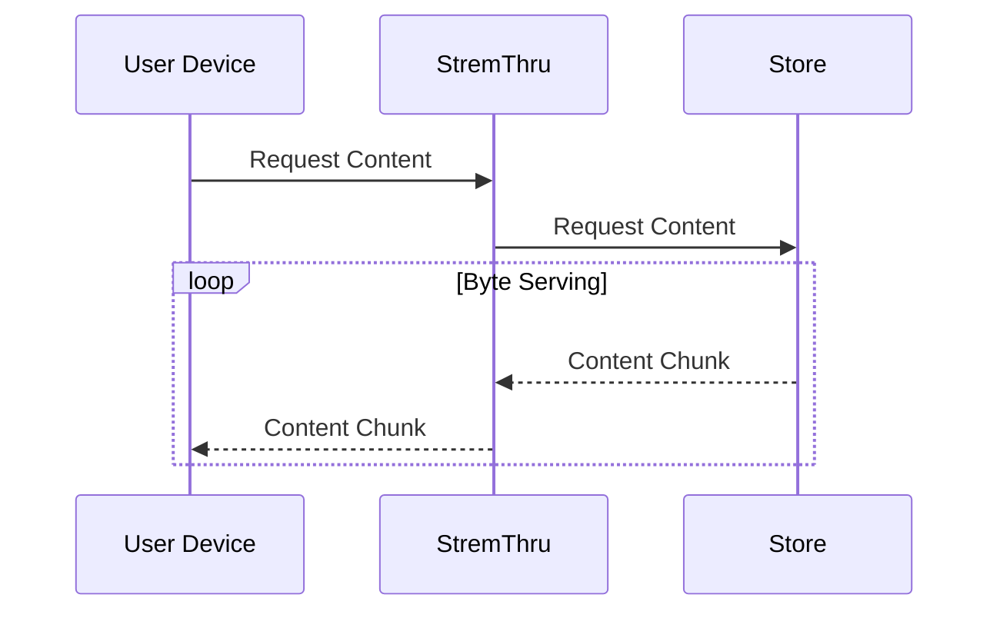
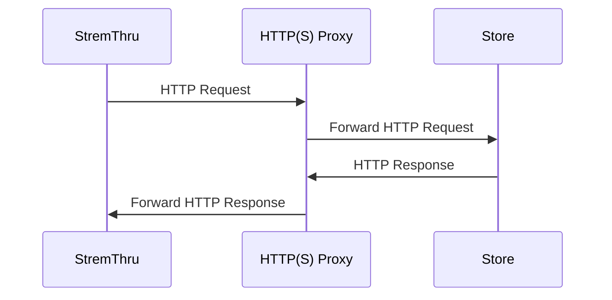

# StremThru

Companion for Stremio.

Check [documentation](https://docs.stremthru.13377001.xyz).

## Features

- HTTP(S) Proxy
- Proxy Authorization
- [Byte Serving](https://en.wikipedia.org/wiki/Byte_serving)

### Store Integration

- [AllDebrid](https://alldebrid.com)
- [Debrider](https://debrider.app)
- [Debrid-Link](https://debrid-link.com/id/4v8Uc)
- [EasyDebrid](https://easydebrid.com)
- [Offcloud](https://offcloud.com/?=ce30ae1f)
- [PikPak](https://mypikpak.com/drive/activity/invited?invitation-code=46013321)
- [Premiumize](https://www.premiumize.me/ref/634502061)
- [RealDebrid](http://real-debrid.com/?id=12448969)
- [TorBox](https://torbox.app/subscription?referral=fbe2c844-4b50-416a-9cd8-4e37925f5dfa)

### SDK

- [JavaScript](./sdk/js)
- [Python](./sdk/py)

### Concepts

#### Store

_Store_ is an external service that provides access to content. StremThru acts as an interface for the _store_.

#### Store Content Proxy

StremThru can proxy the content from the _store_. For proxy authorized requests, this is enabled by default.

#### Store Tunnel

If you can't access the _store_ using your IP, you can use HTTP(S) Proxy to tunnel the traffic to the _store_.

## Configuration

Check [documentation](https://docs.stremthru.13377001.xyz/configuration).

### Stremio Addons

Check [documentation](https://docs.stremthru.13377001.xyz/stremio-addons).

## Sponsors

- [DanaramaPyjama](https://x.com/danaramaps4)
- [Debridio](https://debridio.com)

## License

Licensed under the MIT License. Check the [LICENSE](./LICENSE) file for details.
