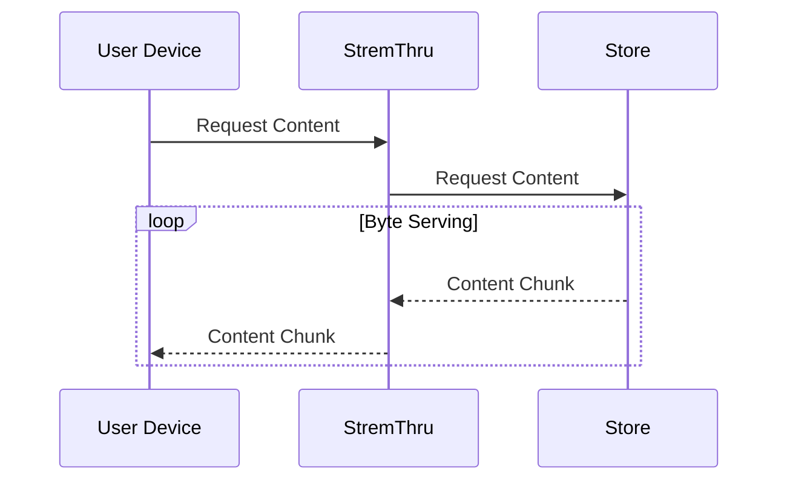
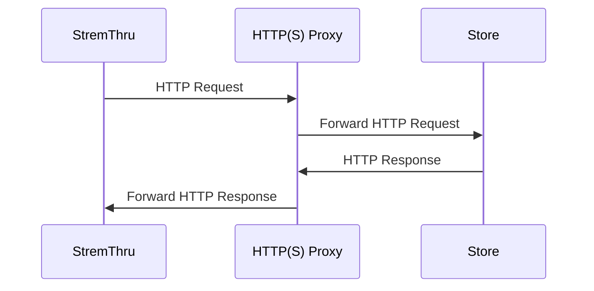

# Introduction

StremThru is a companion service for [Stremio](https://www.stremio.com/). It provides an HTTP(S) proxy with authorization, debrid store integrations through a unified API, content proxying with byte serving, and a suite of Stremio addons.

## Core Concepts

### Store

A _Store_ is an external debrid service that provides access to content. StremThru acts as a unified interface for interacting with these stores.

Supported stores:

| Store                                   | Identifier   |
| --------------------------------------- | ------------ |
| [AllDebrid](https://alldebrid.com)      | `alldebrid`  |
| [Debrider](https://debrider.app)        | `debrider`   |
| [Debrid-Link](https://debrid-link.com)  | `debridlink` |
| [EasyDebrid](https://easydebrid.com)    | `easydebrid` |
| [Offcloud](https://offcloud.com)        | `offcloud`   |
| [PikPak](https://mypikpak.com)          | `pikpak`     |
| [Premiumize](https://www.premiumize.me) | `premiumize` |
| [RealDebrid](https://real-debrid.com)   | `realdebrid` |
| [TorBox](https://torbox.app)            | `torbox`     |

### Store Content Proxy

StremThru can proxy content from the store to your device. For proxy-authorized requests, this is enabled by default.

### Store Tunnel

If you can't access a store directly from your IP, you can use an HTTP(S) proxy to tunnel the traffic.

## Stremio Addons

StremThru includes six built-in Stremio addons:

- **[Store](/stremio-addons/store)** — Browse and search your store catalog
- **[Wrap](/stremio-addons/wrap)** — Wrap other Stremio addons with StremThru
- **[Sidekick](/stremio-addons/sidekick)** — Extra features for Stremio (addon management, library backup/restore)
- **[Torz](/stremio-addons/torz)** — Torrent indexer integration
- **[Newz](/stremio-addons/newz)** — Stream Usenet content via Newznab indexers
- **[List](/stremio-addons/list)** — Generate catalogs from external lists (Trakt, TMDB, AniList, etc.)

## SDKs

Official SDKs are available for programmatic access:

- **[JavaScript](/sdk/javascript)** — `npm install stremthru`
- **[Python](/sdk/python)** — `pip install stremthru`
